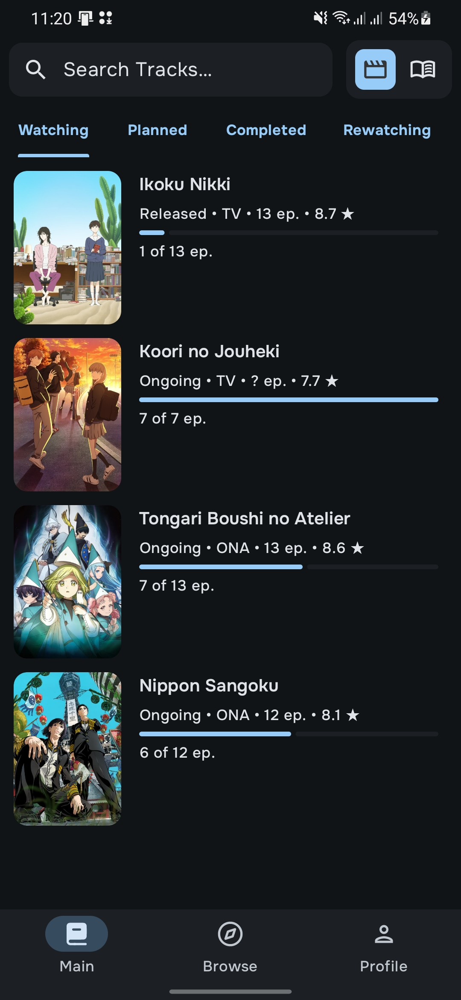
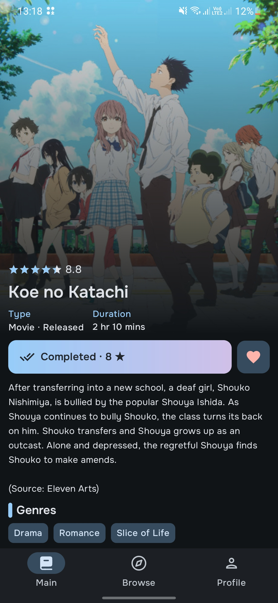
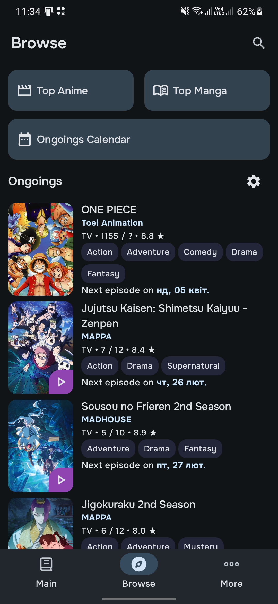
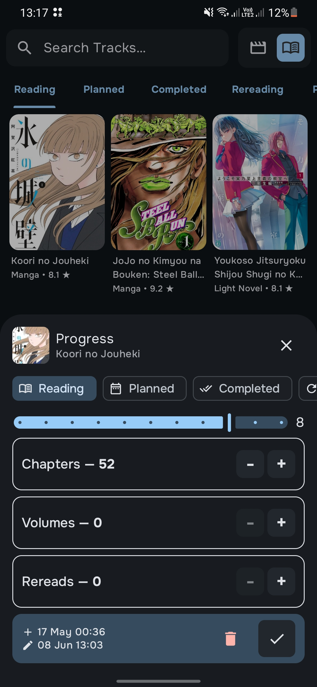

# ShikiFlow
(UNOFFICIAL) Android [Shikimori](https://shikimori.one/) and [AniList](https://anilist.co) Client

## About the Project
ShikiFlow is an Android app for users of the Shikimori and AniList platforms that lets you track your 
anime and manga, stream episodes via the Kodik API (limited to Shikimori users only), 
and read manga in the App via the MangaDex API.

## Tech Stack
Kotlin - Jetpack Compose - MVVM - Hilt - Room - GraphQL (Apollo) - Coil - ExoPlayer

## Screenshots
|  |  |  |  |
|:--------------------------------------------------------------------:|:---------------------------------------------------------------:|:--------------------------------------------------------------:|:--------------------------------------------------------------------:|
|                          Anime Tracks Page                           |                          Details Page                           |                          Browse Page                           |                          Manga Tracks Page                           |"

## How to Use the App
1. Go to [Releases](https://github.com/horisu-zu/ShikiFlow/releases) and download latest (preferably) version.
2. Launch the app and sign in using your existing Shikimori or AniList account credentials. 
In case you don't have an account yet, you'll need to create one on the 
correspondent [Shikimori](https://shikimori.one/) and [AniList](https://anilist.co) website first.
