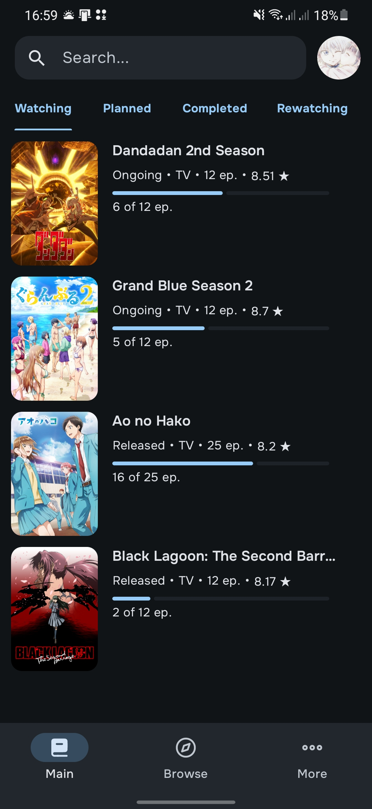
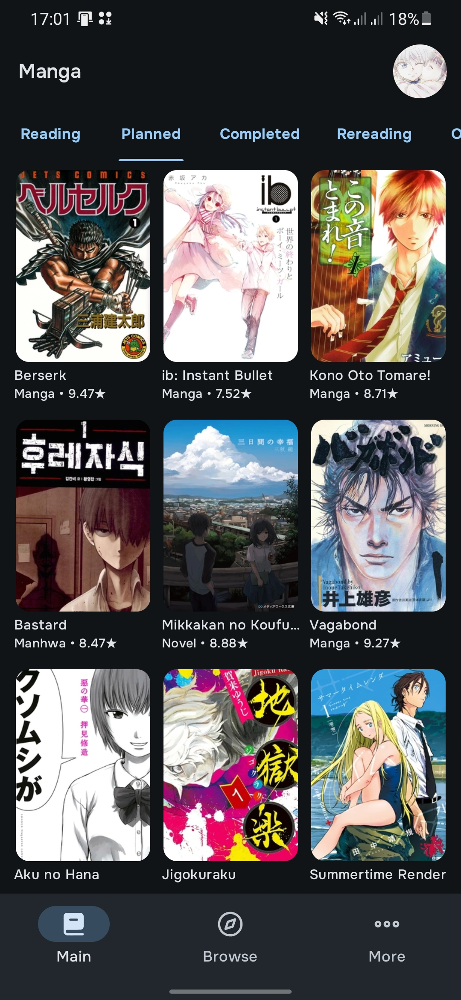

# ShikiFlow
(UNOFFICIAL) [Shikimori](https://shikimori.one/) Mobile App

## About the Project
ShikiFlow is an Android app for Shikimori platform users that lets you track your anime and manga, stream episodes via the Kodik API, and read manga chapters directly through the MangaDex API.

## Tech Stack
Kotlin - Jetpack Compose - MVVM - Hilt - Room - GraphQL (Apollo) - Coil - ExoPlayer

## Screenshots
|  |  |  |  |
|:--------------------------------------------------------------------:|:---------------------------------------------------------------:|:--------------------------------------------------------------:|:--------------------------------------------------------------------:|
|                          Anime Tracks Page                           |                          Details Page                           |                          Browse Page                           |                          Manga Tracks Page                           |"

## How to use the app
1. Go to [Releases](https://github.com/horisu-zu/ShikiFlow/releases) and download latest (preferably) version.
2. Launch the app and sign in using your existing Shikimori account credentials. In case you don't have an account yet, you'll need to create one on the [website](https://shikimori.one/) first.
