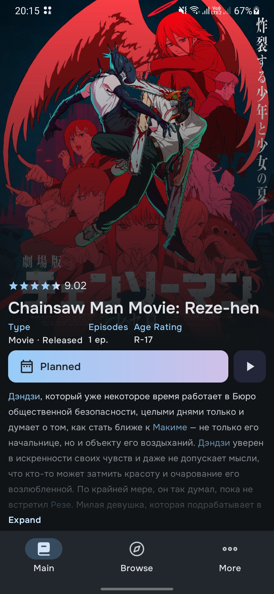

# ShikiFlow
(NON-OFFICIAL) [Shikimori](https://shikimori.one/) Mobile App

Development status: On Hold

## About the Project
ShikiFlow is an Android app for Shikimori users that lets you track what you're watching/reading, and read manga chapters directly in the app (via MangaDex).

## Tech Stack
Kotlin - Jetpack Compose - MVVM - Hilt - GraphQL (Apollo) - Coil

## Screenshots
|  |  |  |  |
|:--------------------------------------------------------------------:|:---------------------------------------------------------------:|:--------------------------------------------------------------:|:--------------------------------------------------------------------:|
|                          Anime Tracks Page                           |                          Details Page                           |                          Browse Page                           |                          Manga Tracks Page                           |"

## How to use the app
1. Go to [Releases](https://github.com/horisu-zu/ShikiFlow/releases) and download latest (preferably) version.
2. Launch the app and sign in using your existing Shikimori account credentials. In case you don't have an account yet, you'll need to create one on the [website](https://shikimori.one/) first.

## API keys
First of all, you need to obtain and add the required keys for [Shikimori](https://shikimori.one/oauth)

The app is using OAuth authentication and currently has `shikiflow://oauth/shikimori` as its OAuth redirect URI.
